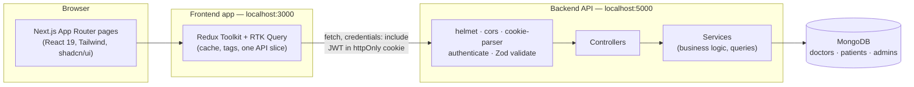
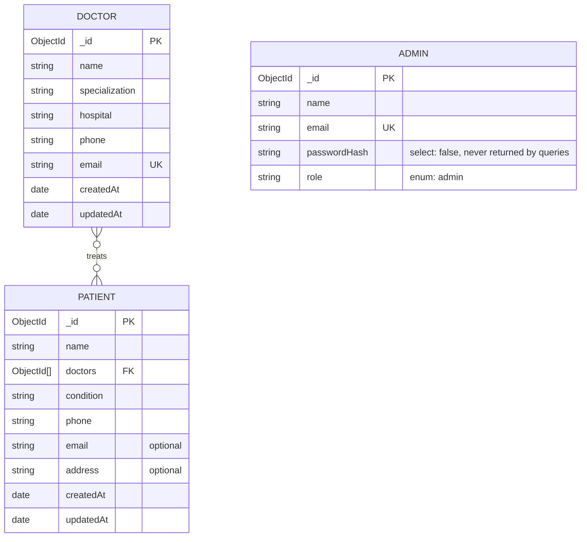

# Doctor Tracker

A secure, full-stack administrative web application for hospital/clinic staff to manage doctors, patients, and the relationships between them — with search, filtering, pagination, and a live analytics dashboard.

## Live Demo

- **URL:** https://frontend-fardin8.vercel.app
- **Email:** admin@doctortracker.com
- **Password:** Admin@12345

---

## Table of Contents

1. [Elevator Pitch](#elevator-pitch)
2. [Features](#features)
3. [Technology Stack](#technology-stack)
4. [System Architecture](#system-architecture)
5. [Folder Structure](#folder-structure)
6. [Database Design](#database-design)
7. [API Overview](#api-overview)
8. [Authentication Flow](#authentication-flow)
9. [Installation Guide](#installation-guide)
10. [Environment Variables](#environment-variables)
11. [Technical Decisions](#technical-decisions)
12. [Performance Optimization](#performance-optimization)
13. [Screenshots](#screenshots)
14. [Future Improvements](#future-improvements)

---

## Elevator Pitch

Doctor Tracker is an admin-only portal that gives a clinic or hospital administrator a single place to manage their roster of doctors and the patients assigned to them. Instead of spreadsheets, an admin gets a real application: authenticated login, full CRUD for doctors and patients, a searchable/filterable/paginated list for both, a doctor's own page showing exactly who their patients are, and a dashboard with real-time charts summarizing the practice (total doctors/patients, patient load per doctor, and activity over time).

It's built as two independently deployable applications — a Next.js frontend and an Express/MongoDB REST API — communicating over a JSON API secured by an httpOnly JWT cookie, with no public sign-up: admin accounts are provisioned out-of-band via a CLI script.

## Features

**Authentication**
- Email/password login for admin accounts (no public self-registration)
- JWT stored in an httpOnly, `SameSite=Lax` cookie — never exposed to client-side JavaScript
- Session verified against the backend on every protected page load (`/auth/me`), not trusted from local state
- Rate-limited login endpoint to slow brute-force attempts
- Logout clears the session cookie server-side

**Doctor Management**
- Create, read, update, delete doctor profiles (name, specialization, hospital, phone, email)
- Search across name/specialization/hospital/email (MongoDB text index)
- Filter by specialization, hospital, and date-added range
- Server-side pagination
- A doctor's detail page lists their patients, with add/edit/delete scoped to that doctor and the doctor field automatically locked to include them

**Patient Management**
- Create, read, update, delete patient records, each linked to one or more doctors
- Search across name/email/phone/condition (MongoDB text index)
- Filter by condition, assigned doctor, and date-added range — filters compose together
- Server-side pagination
- Deleting a doctor removes them from their patients' records; a patient left with no remaining doctor is deleted, keeping "at least one doctor" an enforced invariant

**Dashboard & Analytics**
- Total doctors / total patients stat cards
- "Patients per Doctor" horizontal bar chart (top doctors by patient count)
- "Activity Over Time" line chart (doctors/patients added, selectable 7‑day / 30‑day / 12‑month range)
- All charts driven by live MongoDB aggregation queries — no mock data
- Loading, empty, and error states on every chart and stat

**Cross-cutting**
- Consistent `{ success, message, ...data }` JSON response shape and HTTP status codes across every endpoint
- Centralized validation (Zod) and error handling on the backend; centralized error-message extraction on the frontend
- Fully responsive UI (desktop, tablet, mobile) with a collapsible sidebar, responsive data tables, and adaptive forms/dialogs
- Toast notifications, confirmation dialogs for destructive actions, and skeleton loading states throughout

## Technology Stack

| Layer | Technology |
|---|---|
| Frontend framework | [Next.js 16](https://nextjs.org) (App Router, TypeScript) |
| UI components | [shadcn/ui](https://ui.shadcn.com) (Radix UI primitives) + [Tailwind CSS v4](https://tailwindcss.com) |
| Icons | [Lucide React](https://lucide.dev) |
| Client state / data fetching | [Redux Toolkit](https://redux-toolkit.js.org) + [RTK Query](https://redux-toolkit.js.org/rtk-query/overview) |
| Forms & validation (client) | [React Hook Form](https://react-hook-form.com) + [Zod](https://zod.dev) |
| Charts | [Recharts](https://recharts.org) |
| Backend runtime | [Node.js](https://nodejs.org) + [Express](https://expressjs.com) (TypeScript) |
| Database | [MongoDB](https://www.mongodb.com) via [Mongoose](https://mongoosejs.com) |
| Validation (server) | [Zod](https://zod.dev) |
| Authentication | [JSON Web Tokens](https://jwt.io) in an httpOnly cookie, [bcryptjs](https://www.npmjs.com/package/bcryptjs) for password hashing |
| Security middleware | [Helmet](https://helmetjs.github.io), [CORS](https://www.npmjs.com/package/cors), [express-rate-limit](https://www.npmjs.com/package/express-rate-limit) |

## System Architecture

The frontend and backend are two separate applications that only ever talk to each other over HTTP(S), as JSON — there is no server-side rendering that reaches into the database directly, and no shared code/runtime between them.



Request lifecycle for a typical protected request:

1. The browser calls an RTK Query endpoint (e.g. `useGetDoctorsQuery`); the httpOnly session cookie is attached automatically (`credentials: "include"`).
2. Express middleware runs in order: `helmet` (security headers) → `cors` (origin allow-list) → `cookie-parser` → route-level `authenticate` (verifies the JWT) → route-level `validate` (Zod schema for body/params/query).
3. The controller parses the already-validated request and calls a service function.
4. The service runs the Mongoose query/aggregation against MongoDB and returns plain data.
5. The controller sends a consistent `{ success: true, ... }` JSON response (or a centralized error handler sends `{ success: false, message, errors? }` with the right HTTP status).
6. RTK Query caches the result under a tag (e.g. `Doctor`, `Patient`, `Dashboard`); any mutation that changes that data invalidates the relevant tag so every screen showing it refetches automatically.

## Folder Structure

```
Doctor Tracker/
├── backend/                     Express + TypeScript REST API
│   └── src/
│       ├── config/              env.ts, db.ts (MongoDB connection), corsOptions.ts
│       ├── controllers/         Request handlers — parse request, call a service, send response
│       ├── middleware/          authenticate, validate, errorHandler, notFound, asyncHandler
│       ├── models/              Mongoose schemas: Doctor, Patient, Admin
│       ├── routes/              Express routers, mounted under /api in routes/index.ts
│       ├── services/            Business logic and MongoDB queries/aggregations
│       ├── validators/          Zod request-validation schemas (body/params/query)
│       ├── utils/                ApiError, jwt, pagination helpers
│       ├── scripts/              createAdmin.ts — provisions admin accounts (no public signup)
│       ├── app.ts                Express app: middleware + route wiring
│       └── server.ts             Entry point — connects to MongoDB, then starts listening
│
├── frontend/                    Next.js 16 (App Router) + TypeScript
│   └── src/
│       ├── app/                  Routed pages: login/, (dashboard)/{dashboard,doctors,patients}/
│       ├── components/
│       │   ├── ui/               shadcn/ui primitives (generated, then customized)
│       │   ├── common/           Reusable app components: PageHeader, tables' shared bits,
│       │   │                     SearchBar, FilterBar, Pagination, EmptyState, ErrorState, dialogs
│       │   └── layout/           AppSidebar, Navbar, MainLayout, AuthGuard
│       ├── features/             One folder per domain — auth/, doctors/, patients/, dashboard/
│       │                         (RTK Query API slice, forms, dialogs, tables per feature)
│       ├── store/                Redux store, typed hooks, the base RTK Query api slice
│       ├── types/                Shared TypeScript types mirroring API response shapes
│       ├── utils/                formatDate, getErrorMessage, buildQueryString
│       ├── constants/            routes.ts — centralized route paths
│       └── hooks/                Reusable custom hooks (e.g. use-mobile)
│
├── docs/
│   └── screenshots/              desktop/ and mobile/ — see Screenshots section
│
└── README.md
```

## Database Design

MongoDB with three collections. Doctors and Patients are many-to-many via an array of references on the patient (not embedding, and no separate join collection — Mongo indexes the array directly).



**Indexes**

| Collection | Index | Purpose |
|---|---|---|
| `doctors` | `{ name, specialization, hospital, email }` (text, named `doctor_search_text_index`) | Powers the doctor search box |
| `doctors` | `{ specialization: 1, hospital: 1 }` | Speeds up combined specialization + hospital filtering |
| `doctors` | `{ createdAt: -1 }` | Default newest-first sort and date-range filtering |
| `patients` | `{ doctors: 1, createdAt: -1 }` (multikey) | The "patients belonging to doctor X, newest first" query used on a doctor's own page |
| `patients` | `{ createdAt: -1 }` | Default newest-first sort on the flat patients list |
| `patients` | `{ name, email, phone, condition }` (text, named `patient_search_text_index`) | Powers the patient search box |
| `patients` | `{ condition: 1 }` | Speeds up the condition filter |

MongoDB allows only **one** text index per collection, so both text indexes above are given explicit, stable names — this means a future change to the searchable field set alters the existing index in place instead of silently failing to create a differently-shaped one alongside a stale leftover.

A patient's `doctors` array must contain at least one id — enforced by a schema validator (Mongoose's built-in `required` only checks the path is defined, not non-empty) rather than relying on the reference always resolving.

## API Overview

All routes are mounted under `/api`. Every response is JSON, shaped as either `{ success: true, ... }` or `{ success: false, message, errors? }`. Every route except `/health` and `/auth/login` requires a valid session cookie.

| Method | Endpoint | Description |
|---|---|---|
| GET | `/api/health` | Server, API, and database connectivity status |
| POST | `/api/auth/login` | Log in with email + password, sets the session cookie |
| GET | `/api/auth/me` | Returns the currently authenticated admin |
| POST | `/api/auth/logout` | Clears the session cookie |
| GET | `/api/doctors` | List doctors — supports `search`, `specialization`, `hospital`, `dateFrom`, `dateTo`, `page`, `limit` |
| POST | `/api/doctors` | Create a doctor |
| GET | `/api/doctors/:id` | Get one doctor |
| PUT | `/api/doctors/:id` | Update a doctor (at least one field required) |
| DELETE | `/api/doctors/:id` | Delete a doctor (removed from their patients; patients left with no doctor are deleted) |
| GET | `/api/doctors/:id/patients` | List a specific doctor's patients — same filters/pagination as `/patients`, `doctor` fixed by the URL |
| GET | `/api/patients` | List patients — supports `search`, `condition`, `doctorId`, `dateFrom`, `dateTo`, `page`, `limit` |
| POST | `/api/patients` | Create a patient (must reference at least one existing doctor) |
| GET | `/api/patients/:id` | Get one patient |
| PUT | `/api/patients/:id` | Update a patient (at least one field required) |
| DELETE | `/api/patients/:id` | Delete a patient |
| GET | `/api/dashboard/overview` | Total doctor and patient counts |
| GET | `/api/dashboard/patients-per-doctor` | Top N doctors by patient count (`limit` query param) |
| GET | `/api/dashboard/date-statistics` | Doctors/patients added over time (`range`: `7d` \| `30d` \| `12m`) |

**Error handling:** invalid/malformed IDs and request bodies are rejected with `400` before touching the database (validated by Zod); a well-formed ID that doesn't exist returns `404`; an unauthenticated or session-expired request returns `401`; a duplicate-key conflict (e.g. an email already in use) returns `409`.

## Authentication Flow

There is no public registration — admin accounts are created out-of-band via the `create-admin` CLI script, matching an admin-only, invite-style access model.

1. **Login** — the admin submits email/password to `POST /api/auth/login`. The backend looks up the admin (password hash is normally excluded from queries via `select: false`, and is explicitly selected only here), verifies it with `bcrypt.compare`, and on success signs a JWT (`{ adminId, role }`) and sets it as an **httpOnly, `SameSite=Lax`** cookie. The token is never readable by client-side JavaScript, which rules out theft via XSS.
2. **Session check** — the frontend's `AuthGuard` wraps every protected page and calls `GET /api/auth/me` on mount. It never trusts client-side state to decide whether the user is logged in; it always asks the backend, which verifies the JWT from the cookie.
3. **Authenticated requests** — every subsequent RTK Query request sends `credentials: "include"`, so the browser attaches the session cookie automatically; the backend's `authenticate` middleware verifies it before any route handler runs.
4. **Session expiry mid-use** — if the cookie is missing, expired, or invalid, protected endpoints return `401`. A global RTK Query interceptor watches for `401` responses (except from `/auth/login` and `/auth/me`, which need to show their own inline error instead) and redirects the browser to `/login`, so a session dying mid-task doesn't leave the admin stuck on a silently-broken page.
5. **Logout** — `POST /api/auth/logout` clears the cookie server-side; the frontend then redirects to `/login`.

## Installation Guide

### Prerequisites

- [Node.js](https://nodejs.org) 20 or later
- A running MongoDB instance — either local or [MongoDB Atlas](https://www.mongodb.com/atlas)
- npm (ships with Node.js)

### 1. MongoDB Setup

Pick one:

**Option A — Local MongoDB**
1. Install MongoDB Community Server for your OS: https://www.mongodb.com/try/download/community
2. Start it (it listens on `mongodb://127.0.0.1:27017` by default).
3. No database or collections need to be created manually — Mongoose creates the `doctor_tracker` database and its collections/indexes automatically the first time the backend connects and the models are used.

**Option B — MongoDB Atlas (cloud, free tier available)**
1. Create a free cluster at https://www.mongodb.com/atlas.
2. Add your IP to the cluster's network access list (or allow access from anywhere for local development).
3. Create a database user and copy the connection string — you'll paste it into `MONGODB_URI` below.

### 2. Backend Setup

```bash
cd backend
npm install
cp .env.example .env      # then edit .env — see Environment Variables below
npm run dev                 # starts the API on http://localhost:5000
```

Create the first admin account (there is no sign-up UI):

```bash
npm run create-admin -- --name "Jane Doe" --email admin@doctortracker.com --password "ChangeMe123"
```

(Or set `ADMIN_NAME` / `ADMIN_EMAIL` / `ADMIN_PASSWORD` in `.env` and run `npm run create-admin` with no flags. Running it again with the same email updates that admin's name/password instead of creating a duplicate.)

Verify the backend is up:

```bash
curl http://localhost:5000/api/health
# {"success":true,"server":{"status":"running",...},"api":{"status":"ok"},"database":{"status":"connected",...}}
```

`database.status` must say `connected` — if it says `disconnected`, MongoDB isn't reachable at the configured `MONGODB_URI`.

### 3. Frontend Setup

```bash
cd frontend
npm install
cp .env.example .env.local   # NEXT_PUBLIC_API_URL should point at the backend above
npm run dev                    # starts the app on http://localhost:3000
```

Open http://localhost:3000, sign in with the admin account created above, and you should land on the dashboard.

### Useful scripts

| Location | Command | What it does |
|---|---|---|
| `backend/` | `npm run dev` | Start the API with hot reload |
| `backend/` | `npm run build` / `npm start` | Compile to `dist/` and run the compiled server |
| `backend/` | `npm run typecheck` | TypeScript check with no build output |
| `backend/` | `npm run create-admin` | Create or update an admin account |
| `backend/` | `npm run migrate-patient-doctors` | One-time: migrates patients from the old single `doctor` field to the `doctors` array (run once against any database created before multi-doctor support) |
| `frontend/` | `npm run dev` | Start the Next.js dev server |
| `frontend/` | `npm run build` / `npm start` | Production build and serve |
| `frontend/` | `npm run lint` | ESLint |

## Environment Variables

`.env.example` files are committed in both `backend/` and `frontend/` — copy them to `.env` / `.env.local` respectively and fill in real values. Actual `.env`/`.env.local` files are git-ignored and must never be committed.

**`backend/.env.example`**

| Variable | Description | Default |
|---|---|---|
| `PORT` | Port the API listens on | `5000` |
| `NODE_ENV` | `development` or `production` | `development` |
| `MONGODB_URI` | MongoDB connection string | `mongodb://127.0.0.1:27017/doctor_tracker` |
| `CLIENT_ORIGIN` | Allowed CORS origin — must match the frontend's URL exactly | `http://localhost:3000` |
| `JWT_SECRET` | Secret used to sign session JWTs — **use a long random value in production** | *(dev-only fallback; must be overridden for real use)* |
| `JWT_EXPIRES_IN` | Session token lifetime | `1d` |
| `COOKIE_NAME` | Name of the session cookie | `dt_token` |
| `ADMIN_NAME`, `ADMIN_EMAIL`, `ADMIN_PASSWORD` | Optional — used only by `npm run create-admin` when flags aren't passed | — |

**`frontend/.env.example`**

| Variable | Description | Default |
|---|---|---|
| `NEXT_PUBLIC_API_URL` | Base URL the frontend calls for the API | `http://localhost:5000/api` |

## Technical Decisions

**1. Redux Toolkit + RTK Query for all server state**
Doctors, patients, and dashboard data are all server-owned, frequently cross-referenced (creating a patient affects the doctor's patient count *and* the dashboard), and read from multiple screens at once (the flat patients list, a doctor's own patient list, and search results all show overlapping patient data). RTK Query's tag-based cache (`Doctor`, `Patient`, `Dashboard`, each with per-id and `LIST` tags) means a single mutation — e.g. deleting a doctor — can precisely invalidate exactly the cached queries it affects, and every screen showing that data refetches automatically with no manual cache-busting code. It also gives loading/error/fetching state, request de-duplication, and background refetching for free, which is why nothing here reaches for a separate data-fetching library or hand-rolled `useEffect` fetch logic.

**2. MongoDB indexing strategy over generic full-collection scans**
Every query the UI actually issues — text search, specialization/hospital/condition filters, date-range filtering, "this doctor's patients sorted newest first" — has a matching index (see [Database Design](#database-design)), verified with `.explain()` during development rather than assumed. This matters in particular for the two text indexes: MongoDB permits only one text index per collection, so each is created with an explicit, stable name; without that, a schema change to the searchable fields would either silently fail to apply (a stale index blocking the new one) or throw a runtime index-conflict error the first time the app started against an existing database — both real issues that were hit and fixed during development, not hypothetical.

**3. shadcn/ui instead of a pre-styled component library**
shadcn/ui isn't an npm dependency you consume as a black box — the component source (`components/ui/`) is generated into the project and owned by it, built on unstyled Radix UI primitives for accessibility (focus management, keyboard nav, ARIA) with Tailwind for styling. That made it possible to reskin the base `Card`, `Button`, table, and sidebar components directly — a project-specific color palette, elevation, and typography scale — without fighting a library's theming API or shipping CSS overrides on top of someone else's opinionated defaults. The tradeoff is that updates aren't a version bump; they're a deliberate re-generation, which is the right tradeoff for an app that wants its own visual identity rather than looking like every other shadcn starter.

**4. httpOnly cookie for the session token instead of `localStorage`**
A JWT in `localStorage` is readable by any script running on the page, which makes it a direct target for XSS. Storing it in an httpOnly cookie instead means client-side JavaScript can never read or exfiltrate it — the browser attaches it to requests automatically (`credentials: "include"`), and the frontend never needs to manage the token at all. The cost is that the frontend can't tell from local state alone whether a session is valid, which is why `AuthGuard` always asks the backend (`GET /auth/me`) rather than trusting anything stored client-side.

## Performance Optimization

**Backend**
- `.lean()` on every read-only Mongoose query (list, get-by-id, and the post-update/delete results) — skips document hydration (change tracking, getters, prototype methods) for data that's only ever going to be JSON-serialized.
- Creating a patient does **one** doctors lookup instead of two — the existence check and the doctor summaries embedded in the response reuse a single `find({ _id: { $in } })`, instead of a separate existence check followed by a `.populate()` re-fetch.
- Dashboard analytics run as MongoDB aggregation pipelines (`$match` → `$group` → `$sort` → `$lookup`), computed entirely in the database in one round trip rather than pulled into application code and reduced there.
- Every filter/search/sort the UI exposes is backed by a real index (see [Database Design](#database-design)); combined queries (e.g. specialization + hospital) use a compound index rather than two separate lookups.
- Consistent, capped pagination (`limit` clamped server-side) on every list endpoint — no unbounded "return everything" queries.

**Frontend**
- RTK Query's normalized cache and tag invalidation mean a screen refetches only when data it actually depends on changes — not on every navigation.
- Debounced search input (avoids firing a request per keystroke).
- `React.memo` on the Doctor/Patient tables paired with `useCallback` on the row-action handlers passed into them, so opening a dialog or toggling a delete confirmation doesn't re-render the entire table underneath it.
- Query parameter objects passed to RTK Query hooks are memoized (`useMemo`) so an unrelated re-render doesn't produce a new object identity and trigger a spurious refetch.
- Next.js App Router code-splits each route automatically; charts (Recharts) and other feature bundles are only loaded on the pages that use them.

## Screenshots

Screenshots aren't embedded in this repository yet — add your own and reference them here before sharing this README externally.

- **Desktop:** save screenshots (1440px-wide browser window recommended) into [`docs/screenshots/desktop/`](docs/screenshots/desktop) — for example `login.png`, `dashboard.png`, `doctors.png`, `doctor-details.png`, `patients.png`.
- **Mobile:** save screenshots (390px-wide, e.g. an iPhone viewport) into [`docs/screenshots/mobile/`](docs/screenshots/mobile) — the same set of pages, to show the responsive layout.

Once added, embed them like this:

```markdown
### Desktop


### Mobile


```

## Future Improvements

- **Multiple admin roles/permissions** — today every admin has identical, full access; a read-only or per-department role would suit a larger team.
- **Refresh tokens** — the session JWT currently has a single fixed expiry (`JWT_EXPIRES_IN`); a refresh-token flow would allow shorter-lived access tokens without forcing frequent re-logins.
- **Audit log** — a record of who created/edited/deleted which doctor or patient record, for accountability in a real clinical setting.
- **Automated tests in CI** — the project was verified throughout development with backend API test scripts and headless-browser (Playwright) end-to-end flows, but these live as development scripts, not a committed, CI-run test suite.
- **Soft delete / archiving** — deleting a doctor or patient today is permanent (with cascade); an archived state would allow recovery and historical reporting.
- **Exporting data** — CSV/PDF export of a filtered doctor or patient list for offline reporting.
- **File attachments** — doctor profile photos or patient documents, backed by object storage rather than the database.
- **Notifications** — e.g. email confirmation when a patient is reassigned to a different doctor.
- **Dark mode toggle** — the design tokens for a dark theme already exist in `globals.css`; only a user-facing toggle and persistence are missing.
- **Real-time updates** — WebSocket or polling-based live updates so two admins working concurrently see each other's changes without a manual refresh.
